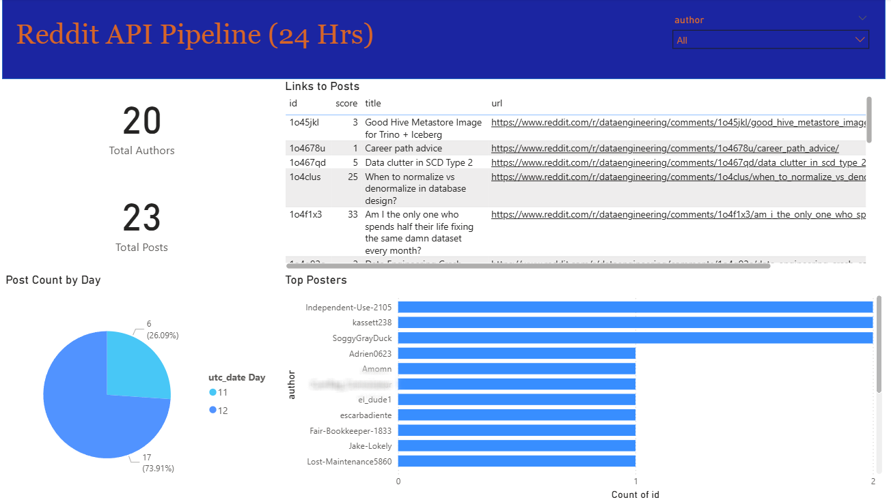

# Reddit API Data Pipeline Project

**Status:** In Progress (Pipeline functional, visualizations in development)

---

## Overview

This project demonstrates a data pipeline for extracting, transforming, and loading data from Reddit using the Reddit API.  
The dataset is stored in AWS Redshift and connected to Power BI for visualization and analysis.

> **Note:** This project was inspired by [ABZ-Aaron’s Reddit API Pipeline tutorial](https://github.com/ABZ-Aaron/reddit-api-pipeline/tree/master/instructions).  
> I followed the tutorial to build the pipeline while applying my own understanding and modifications where applicable.

---

## Technologies Used

- **Python** – data extraction, transformation, and loading (requests, pandas, boto3)
- **Reddit API (PRAW)** – for accessing Reddit data
- **AWS Services:**
  - **S3** – raw and processed data storage
  - **Redshift** – data warehouse for analytics
  - **IAM** – access control and permissions
- **dbt Cloud** – for online data transformation
- **Power BI** – visualization and reporting
- **Airflow (Docker)** – workflow orchestration
- **Terraform** – infrastructure as code (for reference)
- **Git/GitHub** – version control

---

## Features Implemented

- Authenticated connection to Reddit API  
- ETL pipeline built in Python for posts and comments data  
- Data stored and managed in AWS S3 and Redshift  
- Data transformation performed in **dbt Cloud**  
- Visualization setup in **Power BI**  
- Workflow orchestration using **Airflow** in Docker containers  
- Infrastructure defined using **Terraform**

---

## Challenges & Learnings

- Configuring authentication with the Reddit API and AWS IAM.  
- Implementing a reliable ETL flow from extraction to Redshift.  
- Using dbt Cloud for online data transformations.  
- Connecting Power BI to Redshift for initial exploration.  
- Managing Airflow DAGs for automation and scheduling.

---

## Next Steps

- Build interactive Power BI dashboards using Redshift data.  
- Automate ETL pipeline execution using Airflow scheduling.  
- Expand data scope to include Reddit comments and metadata.  
- Optimize AWS storage and data warehouse performance.  
- Continue learning infrastructure automation and CI/CD integration.

---

## 📊 Data Pipeline Architecture

Below is a simplified diagram showing the overall data pipeline flow:

---

## Screenshots & Visuals

### 🧩 Airflow DAG Example
Example DAG orchestrating the ETL process:

*(Sensitive information such as credentials has been removed.)*

---

### 📊 Power BI Visualization (In Progress)

The dataset is connected to Power BI for developing future dashboards.

*(Sample data shown for privacy. Visualizations are under development.)*

---

## Setup Overview

1. Clone this repository to your local environment.  
2. Install project dependencies using the `requirements.txt` file.  
3. Configure Reddit API credentials in a local configuration file.  
4. Set up AWS services (S3, Redshift, IAM) and connect them through `boto3`.  
5. Execute the Python ETL scripts to extract and load data.  
6. Perform data transformations in dbt Cloud.  
7. Connect Power BI to Redshift to create dashboards and explore data.

---

## Author

**Gilbert Walker**  
Data Conversion Specialist transitioning into Data Engineering  
📍 Bethlehem, GA  
🔗 [GitHub Profile](https://github.com/GilbertWalker-DE)

---
