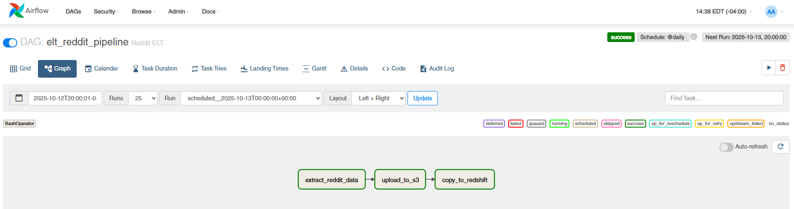
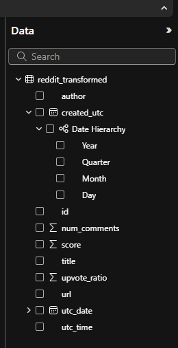

# Reddit API Data Pipeline Project

**Status:** In Progress (Pipeline functional, visualizations in development)

---

## Overview

This project demonstrates a pipeline for extracting, transforming, and loading data from Reddit using the Reddit API. The dataset is stored in AWS Redshift and connected to Power BI for visualization and analysis.

> **Note:** This project was inspired by [ABZ-Aaron’s Reddit API Pipeline tutorial](https://github.com/ABZ-Aaron/reddit-api-pipeline/tree/master/instructions). I followed the tutorial to build the pipeline while applying my own understanding and modifications where applicable.

---

## Technologies Used

- **Python** (requests, pandas, etc.)
- **Reddit API** (PRAW)
- **AWS Services:**
  - **S3** – storing raw and processed data
  - **Redshift** – relational database for analytics
  - **IAM** – managing access and credentials
  - **boto3** – Python SDK for AWS integration
- **dbt** – data transformation
- **Power BI** – for initial data exploration
- **Airflow** – for orchestration
- **Docker** – for containerization
- **Terraform** – infrastructure as code
- **Git/GitHub** – version control

---

## Features Implemented

- Authenticated connection to Reddit API
- Data extraction and transformation for posts and comments
- Loading data into AWS Redshift
- Data transformation using dbt
- Initial connection to Power BI for data exploration
- Orchestration with Airflow in Docker
- Infrastructure setup with Terraform

*Note: Power BI visualizations are currently in progress.*

---

## Challenges & Learnings

- Successfully built the ETL pipeline, handling API authentication, AWS integration, and data storage.
- Implemented data transformations using dbt, enhancing data quality and consistency.
- Connected the dataset to Power BI, learning the initial setup process; advanced visualizations are still a work in progress.
- Gained experience in orchestrating workflows with Airflow and managing infrastructure with Terraform.

---

## Next Steps

- Develop interactive dashboards and visualizations in Power BI.
- Automate ETL updates to Redshift using scheduled scripts.
- Explore additional data insights and analytics from Reddit posts and comments.
- Optimize AWS S3/Redshift architecture for efficiency and cost.
- Enhance Airflow DAGs for better workflow management.

---

## 📊 Data Pipeline Architecture

This diagram illustrates the overall data flow and tool interactions within the Reddit API Data Pipeline.

```mermaid
flowchart LR
    A[Reddit API] --> B[Python ETL Scripts]
    B --> C[AWS S3 (Raw Data Storage)]
    C --> D[AWS Redshift (Data Warehouse)]
    D --> E[dbt (Data Transformation)]
    E --> F[Power BI (Visualization & Reporting)]

    %% Supporting tools
    B -.-> G[Airflow (Workflow Orchestration)]
    C & D -.-> H[Terraform (Infrastructure as Code)]

---

## Screenshots & Visuals

### 📈 Project Architecture
Below is a simplified diagram showing the overall data pipeline flow:


---

### 🧩 Airflow DAG Example
Here’s an example of the Airflow DAG orchestrating the ETL process:



*(Sensitive info such as credentials and connection strings have been removed.)*

---

### 📊 Power BI Visualization (In Progress)
The dataset is successfully connected to Power BI for future dashboard development.



*(Sample data used for privacy. Dashboard visuals under development.)*

---

## Setup Instructions

1. Clone the repository:

```bash
git clone https://github.com/GilbertWalker-DE/Reddit-API-Data-Pipeline.git
```
2.  Install dependencies:

```bash
pip install -r requirements.txt
```

3.  Configure Reddit API credentials:

```bash
# config.py
CLIENT_ID = 'your_client_id'
CLIENT_SECRET = 'your_client_secret'
USERNAME = 'your_reddit_username'
PASSWORD = 'your_password'
USER_AGENT = 'your_user_agent'
```

4.  Configure AWS resources (S3, Redshift, IAM):

```bash
# Create S3 buckets
aws s3 mb s3://reddit-raw-data
aws s3 mb s3://reddit-processed-data

# Set up Redshift cluster via AWS console or Terraform
# Ensure IAM permissions allow read/write access
```

5.  Run ETL scripts:

```bash
python scripts/extract_reddit_data.py
python scripts/transform_load.py
```

6.  Set up dbt models:

```bash
cd dbt/
dbt run
```

7.  Use Airflow for workflow orchestration:

```bash
export AIRFLOW_HOME=~/airflow
airflow db init
airflow webserver -p 8080
airflow scheduler
```

8.  Deploy infrastructure with Terraform:

```bash
cd terraform/
terraform init
terraform apply
```

9.  Connect Power BI to Redshift:

```text
# Use your Redshift cluster endpoint in Power BI
# Begin creating dashboards or visualizations (currently in progress)
```
