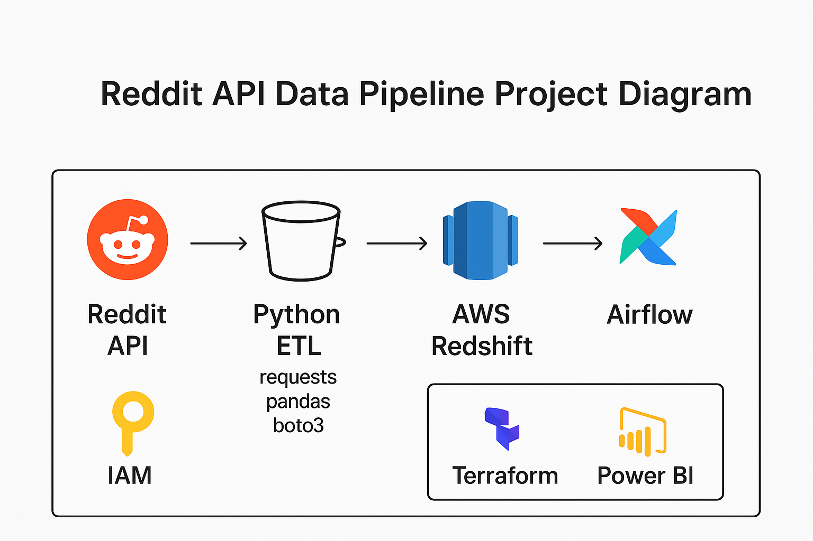

# Reddit API Data Pipeline Project  
🚀 Beginner-to-Pro Journey | Reddit ETL Pipeline with AWS & Power BI

**Status:** ✅ Completed

---

## Overview

This project demonstrates a complete end-to-end data pipeline for extracting, transforming, and loading data from Reddit using the Reddit API.  
The dataset is stored in AWS Redshift and visualized in Power BI to analyze Reddit activity trends and engagement insights.

> **Note:** This was my **first data engineering project**.  
> I followed [ABZ-Aaron’s Reddit API Pipeline tutorial](https://github.com/ABZ-Aaron/reddit-api-pipeline/tree/master/instructions) as a learning guide, implementing the walkthrough code and adapting it to deepen my understanding of ETL pipelines, AWS services, and data visualization.  
> This was also my **first experience using Power BI**, where I successfully built and connected my own dashboard.

---

## Technologies Used

- **Python** – for data extraction and ETL (requests, pandas, boto3)
- **Reddit API (PRAW)** – to collect posts and comments
- **AWS Services:**
  - **S3** – raw and processed data storage
  - **Redshift** – data warehouse for analytics
  - **IAM** – credential and access management
- **dbt Cloud** – for online SQL-based data transformations
- **Airflow (Docker)** – for ETL orchestration and automation
- **Power BI** – for visualization and reporting
- **Terraform** – infrastructure as code (reference)
- **Git/GitHub** – for version control and documentation

---

## 🗺️ Project Architecture Diagram

---

## Features Implemented

- Reddit API authentication and data extraction  
- ETL pipeline with Python for Reddit posts and comments  
- AWS S3 integration for raw and processed data layers  
- Data warehousing using Amazon Redshift  
- Data transformation logic managed through **dbt Cloud**  
- Airflow DAGs orchestrating ETL workflows  
- Power BI dashboard connected to Redshift for interactive analytics  

---

## Challenges & Learnings

- Handling Reddit API rate limits and pagination  
- Managing AWS IAM permissions for secure S3 and Redshift access  
- Debugging Airflow and Docker integration issues  
- Learning **dbt Cloud** for SQL-based transformations  
- Creating and connecting a Power BI dashboard for the first time  

---

## Next Steps

- Refine and expand Power BI visualizations  
- Automate ETL scheduling using Airflow  
- Explore CI/CD automation for dbt model versioning  
- Optimize AWS Redshift query performance  

---

## 📊 Power BI Dashboard

The Power BI dashboard displays key Reddit insights derived from the data pipeline — including subreddit activity, top authors, and engagement metrics.

*(Sample data shown for privacy. Dashboard visuals represent the completed pipeline.)*

---

## 🧩 Airflow DAG Example

Example of the Airflow DAG orchestrating the ETL process:

*(Sensitive credentials and connection strings have been removed.)*

---

## Setup Overview

1. Clone this repository to your local environment.  
2. Install dependencies listed in `requirements.txt`.  
3. Configure Reddit API credentials in a local configuration file.  
4. Set up AWS resources (S3, Redshift, IAM) and connect via `boto3`.  
5. Run Python ETL scripts to extract and load Reddit data.  
6. Perform transformations using dbt Cloud.  
7. Connect Power BI to Redshift and build reports from the dataset.  

---

## Author

**Gilbert Walker**  
Data Conversion Specialist transitioning into Data Engineering  
📍 Bethlehem, GA  
🔗 [GitHub Profile](https://github.com/GilbertWalker-DE)
